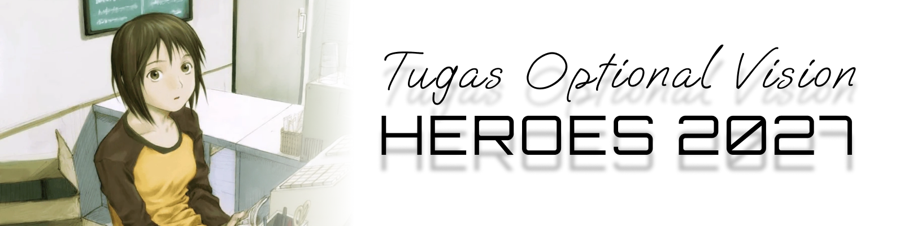
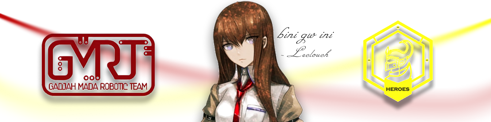

<h1 align="center">ArUco Marker Detection + Pose Estimation</h1>

**Tugas Opsional Programmer Vision - HEROES GMRT ABU Robocon 2027**

*Kalo bisa ngerjain langsung keterima WKWKWKWK* becanda

Proyek ini membangun sistem pengenalan **ArUco marker** (fiducial marker) memakai Python + OpenCV, sebagai dasar *localization* visual untuk robot kompetisi. Robot perlu tahu posisi dirinya dan objek referensi di lapangan tanpa bergantung pada komunikasi wireless antar robot — solusinya, kita tempel marker sebagai **referensi visual statis** yang bisa dibaca kamera robot. Setiap marker punya ID unik yang kita petakan ke satu peran/state (Standby, Ambil, Lepas, Putar CW, Putar CCW), sehingga sekali kamera membaca marker, robot langsung tahu konteks posisi tersebut. Sebagai nilai tambah, proyek ini juga menghitung **pose** (jarak dan orientasi) marker terhadap kamera.

***Penggunaan AI diperbolehkan, tetapi WAJIB paham dan bertanggung jawab atas kode masing-masing. Tulis dokumentasi dengan tanganmu sendiri!***

---

## Read First

Gunakan website dibawah untuk mengenerate ArUco marker.

### → **[https://chev.me/arucogen/](https://chev.me/arucogen/)**

Cara pakainya:

1. Buka situsnya.
2. **Dictionary:** pilih **`4x4 (50, 100, 250, 1000)`**
3. **Marker ID:** isi `0`, lalu ulangi untuk `1`, `2`, `3`, `4`
4. **Marker size, mm:** isi **`100`** (= 10 cm)
5. Klik **"Save this marker as SVG"**, atau pakai link print di halaman itu untuk langsung membuka dialog print / simpan PDF.

> 🚨 **JANGAN pilih opsi `Original ArUco`.** Itu dictionary yang berbeda (`DICT_ARUCO_ORIGINAL`), bukan `DICT_4X4_50` yang dipakai proyek ini. Marker-nya akan tercetak dan kelihatan normal, tapi **tidak akan terdeteksi sama sekali** oleh kode kamu — dan kamu bisa buang waktu berjam-jam nyari bug di kode yang sebenarnya sudah benar. Pastikan yang terpilih adalah opsi **`4x4`**.

> 💡 Opsi 5x5 / 6x6 / 7x7 / AprilTag juga bukan yang kita pakai. Dictionary yang kamu pilih di situs **harus sama** dengan yang kamu tulis di kode (`DICT_4X4_50`).

**Kenapa ukurannya 100 mm?** Karena bonus pose estimation menghitung jarak berdasarkan ukuran fisik marker yang kamu masukkan ke kode. Output situs ini berupa **SVG dengan ukuran milimeter yang tepat**, jadi kalau diprint tanpa penyesuaian skala, hasilnya persis 100 mm dan angka jaraknya akurat. Untuk requirement wajib (deteksi + label), ukuran bebas.

**Kalau tidak punya printer:** tampilkan marker di layar HP/tablet dalam mode *fullscreen* dengan kecerahan tinggi. Deteksi akan tetap jalan dan ini sudah cukup untuk requirement wajib. Tapi untuk pose estimation, **ukur dulu sisi hitam di layar pakai penggaris** lalu sesuaikan angkanya di kode — kalau tidak, semua jaraknya akan salah. Hati-hati juga dengan pantulan cahaya dan *auto-brightness* yang bikin kontras naik-turun.

> ✂️ Kalau digunting, **sisakan margin putih** di keempat sisi marker. Ini bukan soal rapi-rapian — marker tanpa margin putih bisa gagal terdeteksi total karena OpenCV menggunakan white border untuk identifikasi.

---

## Tugasmu!!!

### Wajib

**`detect_markers.py`**. Buat sebuah script yang:

- membuka webcam real-time,
- mendeteksi marker ArUco yang tertangkap kamera,
- menggambar bounding box di sekeliling marker,
- menampilkan **label peran** (bukan cuma angka ID), contoh: `ID 1 - Ambil`,
- output peran ke console,
- tidak crash saat **tidak ada** marker terdeteksi,
- menangani **lebih dari satu** marker dalam frame yang sama.

### Bonus (nilai tambah)

1. **Pose estimation** — hitung jarak (*translation vector*) dan orientasi (*rotation vector*) tiap marker terhadap kamera, dengan asumsi ukuran fisik marker 10 cm × 10 cm, memakai file kalibrasi kamera di folder `calibration/`.
2. **Axis 3D** — gambar sumbu X/Y/Z di atas tiap marker yang berhasil di-pose-estimate.
3. **Info di layar** — tampilkan jarak (cm) dan sudut orientasi sebagai teks di samping tiap marker.

---

##  Yang Dikumpulkan

| # | Deliverable | Keterangan |
|---|---|---|
| 1 | **Link repo GitHub** | Hasil fork. Pastikan repo-nya **publik** supaya bisa dibuka. |
| 2 | **Link video YouTube** | Boleh *unlisted*. Durasi singkat, menunjukkan minimal **3 ID berbeda** terdeteksi dengan label peran yang benar. Kalau mengerjakan bonus, tunjukkan juga axis 3D + jarak/orientasi. |
| 3 | **Dokumentasi** | Cukup buat `SUBMISI.md` di repo yang sama — isinya dokumentasi kode dan link video youtube juga |

> ⚠️ Video harus menunjukkan **kode benar-benar jalan**, bukan screenshot statis.

---

##  Mulai dari Mana?

Kalau bingung mau mulai dari mana, ikuti urutan ini:

1. **Siapkan marker dulu** dari [chev.me/arucogen](https://chev.me/arucogen/) — lihat bagian paling atas README ini. Tanpa ini kamu tidak punya bahan untuk menguji apa pun.
2. **Setup environment** — lihat bagian **Instalasi** di bawah. Pastikan `import cv2` sukses sebelum lanjut.
3. **Tulis `detect_markers.py` bertahap**, jangan langsung semuanya sekaligus:
   - buka webcam → tampilkan frame di window → pastikan bisa keluar pakai tombol `q`
   - deteksi marker → print ID-nya ke terminal dulu, belum usah digambar
   - gambar bounding box
   - tambahkan label peran
   - *(bonus)* pose estimation → axis 3D → teks jarak & sudut
4. **Rekam video demo.**
5. **Buat dokumentasi**

---

##  Skema ID Marker

Dictionary yang dipakai: **`DICT_4X4_50`** (matriks 4×4 bit, kapasitas 50 ID unik).

| ID | Peran | Arti |
|:--:|-------|------|
| 0 | **Standby** | Robot diam menunggu instruksi |
| 1 | **Ambil** | Titik pengambilan objek |
| 2 | **Lepas** | Titik pelepasan objek |
| 3 | **Putar CW** | Rotasi searah jarum jam |
| 4 | **Putar CCW** | Rotasi berlawanan jarum jam |

Di kode, simpan sebagai dict supaya gampang diubah — jangan hardcode angka ID berserakan di tengah logika:

```python
MARKER_ROLES = {
    0: "Standby",
    1: "Ambil",
    2: "Lepas",
    3: "Putar CW",
    4: "Putar CCW",
}
```

---

##  Struktur Repo

```
penugasan_Vision_heroes/
├── detect_markers.py             # ← KAMU YANG BUAT (wajib)
├── requirements.txt              # untuk menginstall dependencies
├── calibration/
│   └── camera_calibration.yml    # ← KAMU YANG SIAPKAN (untuk bonus pose estimation)
├── .gitignore
└── README.md
```

---

##  Hardware Requirements

- **Webcam/Kamera USB:** resolusi minimal 640×480, sudah cukup untuk deteksi. Kamera laptop/built-in OK.
- **Lighting:** ruangan dengan cahaya yang cukup, hindari backlight langsung ke marker (akan terlihat silhouette).
- **Marker fisik:** kertas putih A4 dengan marker 100mm yang sudah diprint, atau layar HP/tablet dengan brightness tinggi.

---

##  Instalasi

**Prasyarat:** Python 3.9 atau lebih baru.

### requirements.txt

File ini berisi daftar Python packages yang dibutuhkan:

```
opencv-contrib-python>=4.5.0
numpy>=1.19.0
```

- **opencv-contrib-python** — versi lengkap OpenCV dengan modul ArUco (bukan `opencv-python` saja)
- **numpy** — dependency OpenCV, untuk operasi array dan matrix

### 1. Clone repo

```bash
git clone https://github.com/Leclouch/ArUco-Detection
cd penugasan_Vision_heroes
```

### 2. Buat virtual environment

Pakai venv supaya versi OpenCV proyek ini tidak bentrok dengan proyek lain di laptopmu.

**Windows (PowerShell):**
```powershell
py -3 -m venv .venv
.\.venv\Scripts\Activate.ps1
```

> Kalau muncul error *"running scripts is disabled on this system"*, jalankan sekali:
> `Set-ExecutionPolicy -Scope CurrentUser RemoteSigned`

**Linux / macOS:**
```bash
python3 -m venv .venv
source .venv/bin/activate
```

Kalau berhasil, prompt terminalmu akan diawali `(.venv)`.

### 3. Install dependencies

```bash
pip install -r requirements.txt
```

### 4. Verifikasi

```bash
python -c "import cv2; print(cv2.__version__, hasattr(cv2, 'aruco'))"
```

Harus mencetak nomor versi dan `True`. Kalau `aruco` bernilai `False` atau muncul `ImportError`, kemungkinan OpenCV versi lama — update dengan `pip install --upgrade opencv-contrib-python`.

---


##  Referensi

| Link | Kegunaan |
|---|---|
| **[chev.me/arucogen](https://chev.me/arucogen/)** | **Ambil marker untuk ngetes kodemu dari sini.** Pilih dictionary `4x4`, ukuran `100` mm. |
| [Dokumentasi ArUco OpenCV](https://docs.opencv.org/4.x/d5/dae/tutorial_aruco_detection.html) | Tutorial resmi deteksi marker |
| [Dokumentasi kalibrasi kamera OpenCV](https://docs.opencv.org/4.x/dc/dbb/tutorial_py_calibration.html) | Kalau mau kalibrasi presisi sendiri pakai checkerboard |


---


___
<p align="center">
Heroes - 2026
</p>